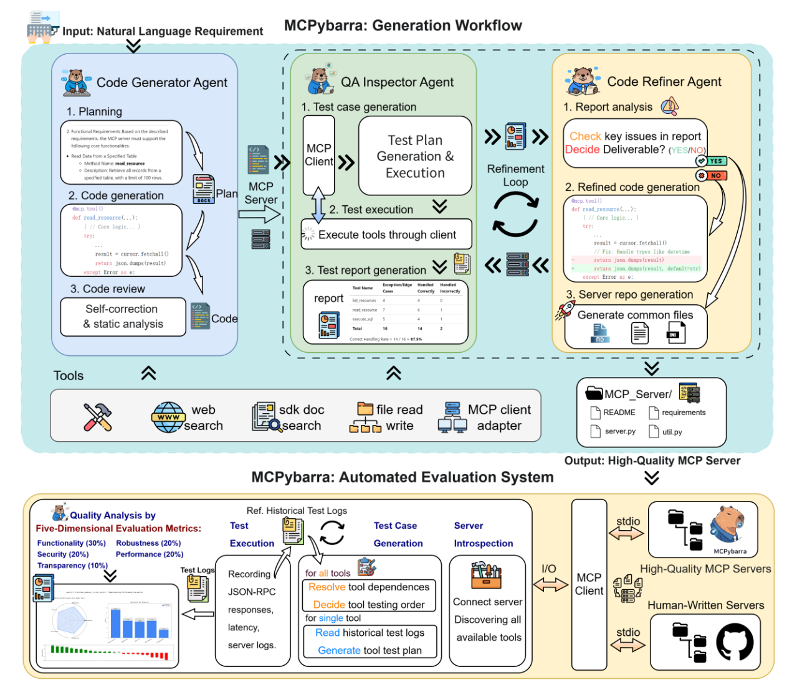

# MCPybarra: A Multi-Agent Framework for Low-Cost, High-Quality MCP Service Generation

## Abstract

Large Language Models (LLMs) increasingly depend on external tools and services for complex task execution, creating unprecedented demand for high-quality, reliable tool ecosystems. The Model Context Protocol (MCP) provides a standardized framework for LLM-tool integration, but its growth is severely constrained by prohibitive development costs and pervasive quality deficits in available services.

We introduce **MCPybarra**, a novel multi-agent framework that automates the generation of high-quality MCP services from natural language requirements. Our approach employs three specialized agents—Code Generator, Quality Assurance Inspector, and Code Refiner—operating within a stateful workflow that implements continuous quality-driven iterative refinement. A comprehensive five-dimensional evaluation system provides objective quality assessment and guides automated improvement.

**Key Results**: Evaluation across 25 diverse MCP services demonstrates that MCPybarra-generated services surpass human-written counterparts in 72% of tasks, with particularly strong performance in non-functional dimensions such as Security (+22.5%) and Robustness (+20%). The framework achieves this quality improvement at costs of $0.018-0.14 per service, representing 2-3 orders of magnitude savings compared to manual development.

## MCPybarra Overview



Our goal is to develop a multi-agent framework for automated high-quality MCP service generation. MCPybarra replicates expert software engineering workflows through three specialized agents operating within a quality-driven iterative refinement process.

### » Code Generator Agent

The Code Generator Agent transforms natural language requirements into complete MCP services through a two-phase process: (1) **Planning phase** - analyzes requirements and generates detailed development plans using external knowledge sources, and (2) **Coding phase** - produces complete server implementations with built-in self-correction to ensure baseline quality before formal Quality Assurance (QA).

### » QA Inspector Agent

The QA Inspector Agent functions as an automated testing engineer, providing comprehensive quality assessment through systematic test generation, execution, and reporting. The agent automatically discovers service capabilities, generates multi-category test suites (functional, security, performance), and produces detailed diagnostic reports with specific improvement recommendations.

### » Code Refiner Agent

The Code Refiner Agent drives the iterative improvement process by analyzing QA reports and implementing targeted fixes. The agent makes explicit quality decisions (DELIVERABLE vs. NEEDS_REFINEMENT) and performs research-driven code refinement, ensuring continuous quality improvement until convergence criteria are met.

## Five-Dimensional Quality Evaluation

Our evaluation system addresses critical gaps in MCP service assessment through a comprehensive quality model:

- **Functionality (30%)**: Measures correct implementation of specified requirements
- **Robustness (20%)**: Assesses resilience to invalid inputs and unexpected conditions
- **Security (20%)**: Evaluates vulnerability prevention and data protection
- **Performance (20%)**: Quantifies operational efficiency and resource utilization
- **Transparency (10%)**: Measures clarity and completeness of documentation

## Experimental Results

### Overall Performance (RQ1)

MCPybarra demonstrates superior performance across the majority of tasks:

- **72% success rate** in surpassing human baselines (18 of 25 tasks)
- **Average quality improvement**: +8.7 points
- **100% testable server generation** vs. MetaGPT's 84%

### Quality Dimension Analysis (RQ2)

MCPybarra shows distinct strengths across quality dimensions:

- **Security**: +22.5% improvement over human baseline
- **Robustness**: +20% improvement over human baseline
- **Functionality**: Variable performance depending on task complexity

### Cost-Effectiveness (RQ4)

- **Generation costs**: $0.018-0.14 per service
- **Cost savings**: 2-3 orders of magnitude vs. manual development ($500-2000 per service)
- **Quality-cost balance**: Superior quality at fractional costs

## Project Structure

```
project_root/
├── framwork/                # Framework code directory
│   ├── mcp_swe_flow/        # MCP SWE workflow implementation
│   │   ├── nodes/           # Workflow nodes (Code Generator, QA Inspector, Code Refiner)
│   │   ├── adapters/        # MCP adapters
│   │   ├── config/          # Configuration files
│   │   ├── prompts/         # Prompt templates
│   │   ├── utils/           # Utility tools
│   │   ├── state.py         # Workflow state definition
│   │   └── graph.py         # Workflow graph definition
│   ├── tool/                # Tool collection
│   └── run_langgraph_workflow.py  # LangGraph workflow entry
├── testSystem/              # Testing system
│   ├── prompts/             # Testing system prompts
│   ├── testFiles/           # Test files
│   ├── utils/               # Testing system tools
│   └── main.py              # Testing system entry
├── resources/               # Resource files
│   ├── mcp-server-doc.md    # MCP protocol documentation
│   ├── metrics.md           # Evaluation metrics documentation
├── logs/                    # Log directory
└── workspace/               # Workspace
    ├── public-mcp-servers/  # Public MCP server examples
    ├── pipeline-output-servers/ # Pipeline output servers
    ├── metaGPT-servers/     # MetaGPT generated servers
    └── refinement/          # Optimized code
```

## Environment Requirements

- **Python Version**: Python 3.12.9
- **Dependencies**: Comprehensive library support for framework and generated MCP servers

## Installation

```bash
# Clone the repository
git clone https://anonymous.4open.science/r/MCPybarra-06C8.git
cd MCPybarra

# Install dependencies
pip install -r requirements.txt
```

## Quick Start Configuration

Create a `.env` file in the project root with the following variables:

```env
# Default model settings
LLM_BASE_URL=your_default_llm_base_url
LLM_API_KEY=your_default_api_key
LLM_MAX_TOKENS=64000
LLM_TEMPERATURE=0.6
LLM_ENABLE_THINKING=false

# Provider-specific settings
QWEN_BASE_URL=your_qwen_base_url
QWEN_API_KEY=your_qwen_api_key

GPTSAPI_BASE_URL=your_gptsapi_base_url
GPTSAPI_API_KEY=your_gptsapi_api_key

GEMINI_BASE_URL=your_gemini_base_url
GEMINI_API_KEY=your_gemini_api_key

# Agent model assignments
SWE_AGENT_MODEL=gpt-4o
SERVER_TEST_AGENT_MODEL=qwen-plus
CODE_REFINER_AGENT_MODEL=qwen-plus
DEFAULT_AGENT_MODEL=qwen-plus
```

## Usage

### Generate and Test MCP Servers

```bash
# Generate MCP server without interaction
python framwork/run_langgraph_workflow.py \
    --swe-model "gemini-2.5-pro" \
    --non-interactive \
    --user-input "Develop an automated Git repository management MCP server that can implement the following functions: use git_init to initialize repositories, use git_status to view status, use git_add to add files to the staging area, use git_diff_unstaged and git_diff_staged to view unstaged and staged differences respectively, use git_diff to compare branches or commits, use git_commit to commit changes, use git_reset to unstage changes, use git_log to view commit history, use git_create_branch to create branches, use git_checkout to switch branches, and use git_show to display detailed commit content."

# Generate MCP server with human confirmation
python framwork/run_langgraph_workflow.py \
    --swe-model "deepseek-v3" \
    --user-input "Develop an automated image retrieval processing MCP server capable of implementing automatic searching of images on the Unsplash platform based on keywords, pagination, sorting, color, and image orientation through the search_photos method, returning result lists containing detailed information such as image ID, description, multi-size image URLs, width, and height."
```

## Acknowledgments

We thank the MCP community and all contributors who have helped improve this framework.

---
